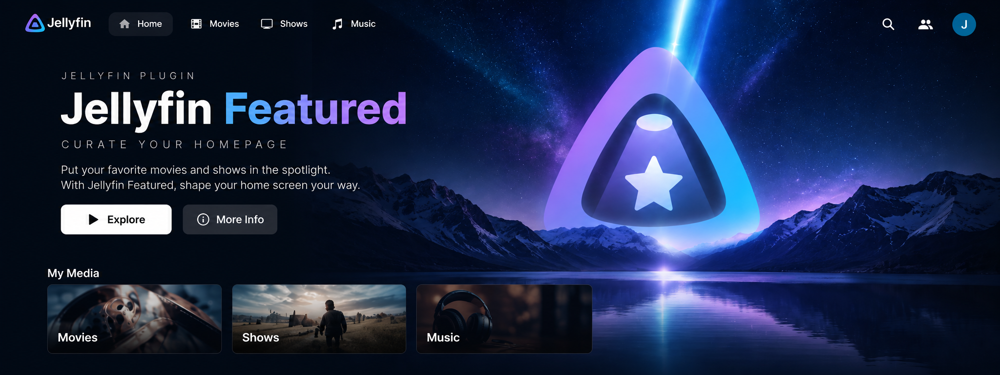
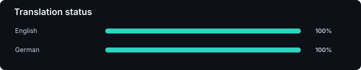

# Jellyfin Featured



`Jellyfin Featured` adds a configurable featured-content carousel to the Jellyfin Web home page.

Build a Netflix-style hero from your Jellyfin libraries, collections, playlists, favourites, tags, recent additions, latest releases, manual lists, random picks, or unplayed media — with per-source weighting, filters, autoplay, layouts, and optional background trailers.

## Credits

Jellyfin Featured is a remake of the original [Jellyfin Editor's Choice plugin](https://github.com/lachlandcp/jellyfin-editors-choice-plugin) by [lachlandcp](https://github.com/lachlandcp). Credit and thanks go to the original project for the idea and foundation.

## Features

- Full-width featured carousel for Jellyfin Web
- Multiple content sources with independent enable/disable state and weighting
- Libraries, collections, favourites, tags, playlists, recently added, latest releases, random, unplayed, and manual lists
- Movies, series, music albums, music videos, videos, audiobooks, books, photos, and photo albums
- Global and source-specific filters for library, genre, tag, media type, played state, ratings, year, runtime, and parental rating
- Optional user profiles with boosts for unplayed items, favourites, preferred genres, and in-progress series
- Standard and hero layouts
- Slide and fade transitions
- Configurable banner height, spacing, title/logo display, ratings, descriptions, navigation, and autoplay controls
- Optional muted local background trailers
- Optional continuous loading of additional featured items
- Keyboard, touch, and navigation controls
- English and German frontend localization with automatic language detection and English fallback
- No runtime CDN dependency

The frontend affects Jellyfin Web clients only. Native TV clients that do not render Jellyfin Web cannot display the carousel.

## Requirements

- Jellyfin Server 12 / .NET 10
- One frontend injection plugin:
  - [File Transformation](https://github.com/IAmParadox27/jellyfin-plugin-file-transformation), or
  - [JavaScript Injector](https://github.com/n00bcodr/Jellyfin-JavaScript-Injector)

Node.js and npm are only required when building the plugin from source.

## Installation

Install Jellyfin Featured and one frontend injection plugin:

1. `Jellyfin Featured`
2. `File Transformation` or `JavaScript Injector`

### Jellyfin Featured

1. Open `Dashboard -> Catalog -> Settings` in Jellyfin.
2. Add this plugin repository:

   ```text
   https://raw.githubusercontent.com/spkesDE/jellyfin-featured-plugin/main/manifest.json
   ```

3. Save, open the plugin catalog, and install `Jellyfin Featured`.
4. Restart Jellyfin.

### File Transformation

1. Add the File Transformation repository:

   ```text
   https://www.iamparadox.dev/jellyfin/plugins/manifest.json
   ```

2. Install `File Transformation`.
3. Restart Jellyfin.

### JavaScript Injector (alternative)

1. Add the JavaScript Injector repository:

   ```text
   https://raw.githubusercontent.com/n00bcodr/jellyfin-plugins/main/10.11/manifest.json
   ```

2. Install `JavaScript Injector`.
3. Restart Jellyfin.

Jellyfin Featured registers its frontend loader automatically. You do not need to paste a script into JavaScript Injector.

You only need one of the two injection plugins. If both are installed, `Automatic` prefers File Transformation and prevents duplicate frontend initialization. You can also explicitly select File Transformation or JavaScript Injector in the plugin settings.

Restart Jellyfin after changing the frontend injection method.

## Setup

1. Open the Jellyfin admin dashboard.
2. Open the `Jellyfin Featured` plugin settings.
3. Configure one or more featured content sources.
4. Adjust source weights and optional filters.
5. Choose the layout, transition, autoplay, and display options you want.
6. Save the configuration.
7. Refresh Jellyfin Web.

A random source is enabled by default, so the carousel can work without building a complex rule set first.

## Content Sources

| Source | Best for |
|---|---|
| Libraries | Featuring content from selected Jellyfin libraries |
| Collections | Curated groups and franchises |
| Favourites | Items marked as favourites |
| Tags | Editorial or metadata-driven selections |
| Playlists | Existing Jellyfin playlists |
| Recently Added | Newly added library content |
| Latest Releases | Recently released media |
| Random | Rotating discovery from eligible items |
| Unplayed | Content the user has not watched or played |
| Manual Lists | Fully curated and ordered featured selections |

Each source can be enabled independently and assigned a relative weight. Global filters apply across the carousel, while source-specific filters let individual sources use different rules.

## Display Options

Jellyfin Featured can be tuned from a simple rotating banner to a more prominent hero layout. Available options include:

- Standard or hero layout, with hero enabled by default
- Auto, compact, standard, cinematic, or custom desktop height plus dedicated tablet and mobile heights
- Configurable border radius, gradient strength, backdrop position, and left/center/right content alignment
- Slide or fade transitions
- Automatic rotation interval
- Primary/secondary buttons, navigation arrows, slide position, pagination dots, and maximum slide count
- Independent rating, description, release-year, and runtime visibility
- Logo or text title display
- Banner height and spacing
- Backdrop positioning and optional reduced image size
- Optional local background trailers
- Optional hiding on TV-style layouts

## Troubleshooting

If the featured carousel does not appear:

1. Make sure `Jellyfin Featured` and either `File Transformation` or `JavaScript Injector` are installed and enabled.
2. Restart Jellyfin after installing or updating plugins.
3. Hard-refresh Jellyfin Web in your browser.
4. Make sure at least one featured source is enabled and can return eligible media.
5. Check that global or source-specific filters are not excluding every item.
6. If both injection plugins are installed, leave the injection method on `Automatic` or select one explicitly.
7. Enable debug logging in the plugin settings if you need additional diagnostics.

If the carousel appears in a browser but not in a native TV app, the client may not render Jellyfin Web and therefore cannot load the frontend plugin.

## Localization

Jellyfin Featured automatically follows the Jellyfin Web language when a matching translation is available. Unsupported languages fall back to English.

[](./src/i18n/locales)

## Documentation

- [Build guide](./BUILD.md)
- [Contributing](./CONTRIBUTING.md)
- [AI assistance disclosure](./AI_USAGE.md)
- [Changelog](./CHANGELOG.md)

## License

This project is licensed under the [MIT License](./LICENSE).
